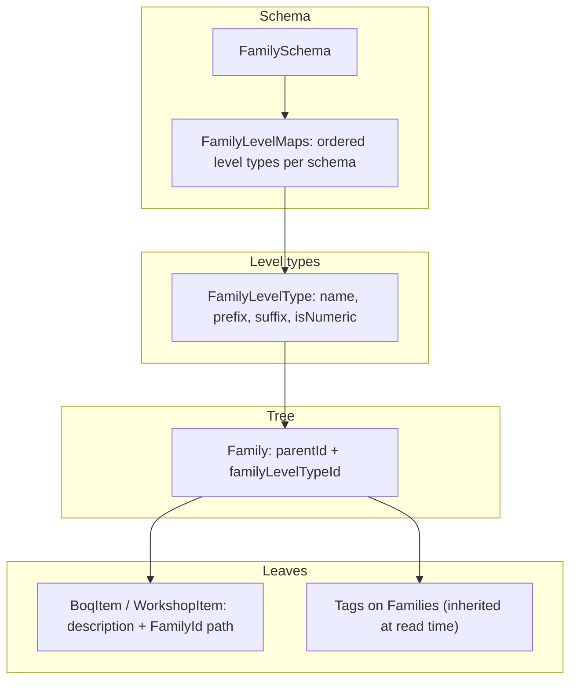

# Port ABRD BOQ Item Categorization to BOQ_Repo

**Clarification:** ABRD "Material Classification" and BOQ "BOQ Item Categorization" are the **same concept**. The ABRD implementation at `d:\Brave\ABRD_Website` is proven — port its logic exactly, but use BOQ Repo terminology and extend existing `Family` / `Workshop` / `BoqItem` code. Do **not** create a parallel `material_*` or `classification/` module.

---

## Terminology mapping (ABRD → BOQ Repo)

| ABRD term | BOQ Repo term | Notes |
|-----------|---------------|-------|
| Material Classification | **BOQ Item Categorization** | Feature name |
| Material (tree node) | **Family** | Hierarchical taxonomy node — Master Spec §4 |
| MaterialItem | **BoqItem** (production) / **WorkshopItem** (staging) | The line being categorized |
| MaterialLevelType | **FamilyLevelType** | Extend with prefix, suffix, isNumeric |
| MaterialLevelMap | **FamilyLevelMap** | Ordered level types per schema |
| ClassificationSchema / MaterialSchema | **FamilySchema** | Replaces ABRD `MC:` prefix hack |
| MaterialPurpose.SystemOption | **FamilyPurpose.SystemFamily** | System taxonomy nodes |
| MaterialPurpose.UserMaterial | **FamilyPurpose.UserFamily** | User-defined branch |
| MaterialTag | **FamilyTag** | Tags on Family nodes |
| buildCodeFromPath | **buildFamilyCodeFromPath** | → `Family.ReferenceCode` |
| GetClassificationStateAsync | **GetFamilyCategorizationState** | Single bootstrap snapshot DTO |
| MaterialService import | **ImportFamilyHierarchy** | Bulk path import |

**What stays BOQ-specific (do not port from ABRD):** Workshop Batch isolation, AI suggestions via `ICategorizationService`, human approval, Publish → `BoqItem.FamilyId` only. These wrap the same categorization tree ABRD uses for materials.

---

## What you are copying (the concept)

BOQ Item Categorization is **not** a simple category dropdown. It is a **4-layer system**:



**Core rules to preserve exactly (from ABRD):**
- Family tree nodes use `parentId` self-reference; depth constrained by schema level order
- Each new child gets the **next** level type from the schema (`levelOrder 1, 2, 3...`)
- Family names unique **per parent + purpose**
- Delete only **leaf** Families (no children)
- Schema save = **replace all** level maps for that schema (validate orders are `1..N`, no duplicate level types)
- Code generation walks schema order + selected path IDs → concatenated tokens ([`material-classification.policy.ts`](d:\Brave\ABRD_Website\FrontEnd\src\app\features\tender\material-classification\domain\policies\material-classification.policy.ts))
- Bootstrap categorization UI from one snapshot DTO (ABRD `MaterialClassificationStateDto` → `FamilyCategorizationStateDto`)

**Phase 1 scope:** schema + level types + Family tree + tags + BoqItem assignment + code gen + CSV import.
**Phase 2 (optional):** per-Family spreadsheets, units, pricing tab.

---

## Step 1 — Extend domain/family/ with ABRD policy (pure TypeScript, no DB yet)

Extend existing [`domain/family/`](d:\GitHub\BOQ_Repo\domain\family\) — do not create `domain/classification/`.

| ABRD source | BOQ file |
|-------------|----------|
| [`material-classification.ts`](d:\Brave\ABRD_Website\FrontEnd\src\app\features\tender\material-classification\domain\entities\material-classification.ts) | Extend `domain/family/` entity types (FamilySchema, FamilyLevelMap, etc.) |
| [`material-classification.policy.ts`](d:\Brave\ABRD_Website\FrontEnd\src\app\features\tender\material-classification\domain\policies\material-classification.policy.ts) | `domain/family/family-code-policy.ts` — copy verbatim: `buildCodeFromPath`, `buildLevelToken`, `parsePathIds`, `buildPathIds`, `normalizeToken` |
| [`MaterialPurpose.cs`](d:\Brave\ABRD_Website\BackEnd\ABRD.SharedKernel\Enums\Tendering\MaterialClassification\MaterialPurpose.cs) | `domain/family/family-purpose.ts` enum: `SystemFamily = 1`, `UserFamily = 2` |

Port tree utilities from [`material-classification.component.utils.ts`](d:\Brave\ABRD_Website\FrontEnd\src\app\features\tender\material-classification\presentation\page\material-classification.component.utils.ts):
- `buildMaterialClassificationTreeIndex()` → `domain/family/family-tree-index.ts`
- Keep: `childrenByParentId`, `pathById`, `pathLabelById`, `getExpectedChildLevelTypeId()` logic

Merge with existing [`familyValidators.ts`](d:\GitHub\BOQ_Repo\domain\family\familyValidators.ts) — leaf-only delete, sibling uniqueness, cycle prevention already partially exist.

Add Vitest tests for policy + tree index first.

---

## Step 2 — Extend Drizzle schema (Postgres on Supabase)

Extend [`drizzle/schema/production-reference.ts`](d:\GitHub\BOQ_Repo\drizzle\schema\production-reference.ts) and add new tables — **do not** create `material_*` tables.

| Table | Maps from ABRD | Key columns |
|-------|----------------|-------------|
| `FamilySchemas` | MaterialCategory (MC:) | `Id`, `Name`, `CreatedAt`, `CreatedBy` |
| `FamilyLevelTypes` (extend) | MaterialLevelType | add `Prefix`, `Suffix`, `IsNumeric`, `StandardUnitId?` |
| `FamilyLevelMaps` | MaterialLevelMap | `Id`, `SchemaId`, `LevelOrder`, `LevelTypeId`, `IsRequired` |
| `Families` (extend) | Material (SystemOption) | add `Purpose`, `Value`, `UnitId`, `IsActive`, `CreatedAt` if missing |
| `Tags` | Tag | `Id`, `Name` (unique) |
| `FamilyTags` | MaterialTag | `FamilyId`, `TagId` (unique pair) |
| `WorkshopItems` / `BoqItems` (extend) | MaterialItem | store `FullName`, `PathIds` on assignment (or derive from FamilyId path) |

**Constraints (match ABRD behavior):**
- `FamilyLevelMaps`: unique `(SchemaId, LevelTypeId)` and `(SchemaId, LevelOrder)`
- `Families`: unique `(ParentId, Name, Purpose)` — enforce in use case + optional partial unique index
- All FKs: `onDelete: 'no action'`
- RLS: enable Supabase RLS as app requires

Run: `npm run db:generate` → review migration SQL → `npm run db:migrate`.

Reference EF configs: ABRD [`MaterialConfiguration.cs`](d:\Brave\ABRD_Website\BackEnd\ABRD.DAL\Tendering\Configurations\MaterialClassification\MaterialConfiguration.cs), [`MaterialLevelMapConfiguration.cs`](d:\Brave\ABRD_Website\BackEnd\ABRD.DAL\Tendering\Configurations\MaterialClassification\MaterialLevelMapConfiguration.cs).

---

## Step 3 — Extend infrastructure repositories

Extend [`infrastructure/persistence/family/`](d:\GitHub\BOQ_Repo\infrastructure\persistence\family\) — one repo per aggregate, **no business logic**:

- `DrizzleFamilyLevelTypeRepository.ts` — extend CRUD with prefix/suffix/isNumeric
- `DrizzleFamilyLevelMapRepository.ts` — `findBySchemaId`, `replaceAllForSchema` (new)
- `DrizzleFamilyRepository.ts` — extend: flat list by purpose, children count
- `DrizzleTagRepository.ts`, `DrizzleFamilyTagRepository.ts` (new)
- `DrizzleFamilyCategorizationStateRepository.ts` — single query bundle (mirrors `GetClassificationStateAsync`)

**Categorization state query** (port from ABRD [`MaterialService.cs`](d:\Brave\ABRD_Website\BackEnd\ABRD.DAL\Tendering\ApplicationServices\MaterialClassification\MaterialService.cs) lines 48–97):
1. Load all `FamilyLevelTypes`
2. Load all `Families` where `purpose = SystemFamily` (with level type + parent joins)
3. Load `WorkshopItems`/`BoqItems` in scope, `Tags`, `FamilyTags` filtered to loaded Family IDs
4. Compute `familySummaries` in application layer: children count, descendant count, direct/inherited tag counts

Return shape = `FamilyCategorizationStateDto` (Zod in `application/dto/family/`).

---

## Step 4 — Extend application use cases + Zod DTOs

Extend [`application/use-cases/family/`](d:\GitHub\BOQ_Repo\application\use-cases\family\) and [`application/use-cases/workshop/`](d:\GitHub\BOQ_Repo\application\use-cases\workshop\) mirroring ABRD services:

| Use case | ABRD reference | Business rules |
|----------|----------------|----------------|
| `GetFamilyCategorizationState` | `MaterialService.GetClassificationStateAsync` | Single bootstrap payload |
| `SaveFamilySchemaHierarchy` | `MaterialLevelMapService.CreateCategoryHierarchyAsync` | Validate order 1..N, no dup level types, delete+insert maps |
| `CreateFamilyLevelType` / update / delete | `MaterialLevelTypeService` | — |
| `CreateFamily` | `MaterialService.CreateOptionsAsync` | Assign next level type from schema; unique name per parent |
| `UpdateFamily` | `MaterialService.UpdateAsync` | Cycle prevention on parent change |
| `DeleteFamily` | `MaterialService.DeleteAsync` | Leaf-only |
| `AssignFamilyTags` / `RemoveFamilyTags` | `MaterialTagService` bulk ops | — |
| `SaveWorkshopItemClassification` (extend) | `MaterialItemService` | Set full name from path labels; store pathIds |
| `PreviewFamilyImport` / `ImportFamilyHierarchy` | `MaterialService` import methods | Path array → create missing Families; apply schema level types by depth |

Port validation constants: max 10,000 rows, name length 160, tag length 64.

Each use case: Zod input → domain logic → repository → Zod output DTO.

**Inherited tags:** compute in `buildFamilySummaries()` by walking ancestors — do not store denormalized inherited tags.

---

## Step 5 — Server actions / route handlers

BOQ Repo uses server actions today ([`app/(dashboard)/families/actions.ts`](d:\GitHub\BOQ_Repo\app\(dashboard)\families\actions.ts)). Extend those to mirror ABRD API contract from [`TenderMaterialClassificationController.cs`](d:\Brave\ABRD_Website\BackEnd\ABRD.API\Controllers\Tendering\MaterialClassification\TenderMaterialClassificationController.cs):

| Method | Surface | Use case |
|--------|---------|----------|
| GET | `getFamilyCategorizationState(schemaId)` | `GetFamilyCategorizationState` |
| GET/POST/PUT/DELETE | Family level type actions | level type CRUD |
| GET | `getFamilySchemaLevelMaps(schemaId)` | get schema |
| POST | `saveFamilySchemaHierarchy(schemaId)` | `SaveFamilySchemaHierarchy` |
| GET/POST/PUT/DELETE | Family CRUD actions | tree node CRUD (`purpose=1` default) |
| GET/POST/PUT/DELETE | Workshop item classification actions | BoqItem assignment CRUD |
| GET/POST/DELETE | Tag actions | tag CRUD |
| POST/DELETE | `bulkAssignFamilyTags` / `bulkRemoveFamilyTags` | bulk assign/remove |
| POST | `previewFamilyImport` | preview |
| POST | `importFamilyHierarchy` | commit |
| GET | `exportFamilyHierarchy` | CSV export |

Pattern:
```
Server Action / Route Handler → Zod parse → use case → DTO
Auth: Supabase session via resolveRequestContext()
```

Optional: also expose as `app/api/family/**/route.ts` if REST clients needed — same use cases underneath.

---

## Step 6 — Frontend (React 19 + Tailwind + Radix)

Extend existing routes — do **not** create `app/(dashboard)/classification/`.

| ABRD UI | BOQ route |
|---------|-----------|
| Schema builder + level type admin | [`app/(dashboard)/families/`](d:\GitHub\BOQ_Repo\app\(dashboard)\families\) — extend with schema admin panel |
| Categorization workspace | [`app/(dashboard)/workshop/categorize/[batchId]/`](d:\GitHub\BOQ_Repo\app\(dashboard)\workshop\categorize\[batchId\]) — extend `CategorizationWorkspace` |

### Data layer
- [`hooks/use-family-categorization-store.ts`](d:\GitHub\BOQ_Repo\hooks\use-family-categorization-store.ts) — port signal pattern from ABRD [`store.ts`](d:\Brave\ABRD_Website\FrontEnd\src\app\features\tender\material-classification\presentation\page\store.ts) using React `useState` + `useReducer`
- On mount: load `FamilyCategorizationState`
- Mutations call server actions → refresh state

### UI layout (match ABRD template)
Reference: [`material-classification.component.html`](d:\Brave\ABRD_Website\FrontEnd\src\app\features\tender\material-classification\presentation\page\material-classification.component.html)

```
┌─────────────────────────────────────────────┐
│ Toolbar: search, schema selector            │
├──────────────┬──────────────────────────────┤
│ Family tree  │ BoqItem detail panel           │
│ (sidebar)    │ - Family path breadcrumb       │
│              │ - workshop lines table         │
│              │ - reference code preview       │
└──────────────┴──────────────────────────────┘
```

Reuse [`components/ui/tree.tsx`](d:\GitHub\BOQ_Repo\components\ui\tree.tsx) and existing [`FamilyTree`](d:\GitHub\BOQ_Repo\app\(dashboard)\families\_components\FamilyTree.tsx).

### Key interactions (port from [`material-classification.component.core.ts`](d:\Brave\ABRD_Website\FrontEnd\src\app\features\tender\material-classification\presentation\page\material-classification.component.core.ts))
1. **Add root Family** — create with `parentId: null`, level type = schema order 1
2. **Add child** — compute expected child level type from schema + parent depth
3. **Rename / delete** — context menu on tree node
4. **Tag assignment** — show direct + inherited tags on selected Family
5. **Generate code** — call `buildFamilyCodeFromPath()` client-side for preview; persist on BoqItem save
6. **Bulk import** — use existing `xlsx` util; map columns to `path[]` + `tags[]`; preview then import

### Schema admin (within /families)
Port from ABRD [`schema-builder`](d:\Brave\ABRD_Website\FrontEnd\src\app\features\tender\material-classification\presentation\page\panels\schema-builder\):
- CRUD level types
- Drag-reorder level types into schema
- Save schema hierarchy

Skip for Phase 1: pricing tab, WebSocket realtime, Family sheets (Phase 2).

---

## Step 7 — Tests (Vitest)

| Test file | What to assert |
|-----------|----------------|
| `family-code-policy.test.ts` | `buildCodeFromPath`, `parsePathIds`, required-level failure |
| `family-tree-index.test.ts` | parent/child maps, path labels |
| `save-family-schema-hierarchy.test.ts` | invalid order sequence rejected; duplicate level type rejected |
| `create-family.test.ts` | unique name per parent; correct level type assignment |
| `delete-family.test.ts` | rejects non-leaf delete |
| `import-family-hierarchy.test.ts` | creates missing path segments; assigns tags on leaf |

Reference: ABRD [`MaterialServiceTests.cs`](d:\Brave\ABRD_Website\BackEnd\ABRD.Tests\Tendering\MaterialClassification\MaterialServiceTests.cs).

---

## Step 8 — Seed data (optional dev bootstrap)

Create `infrastructure/persistence/seeds/family-categorization-seed.ts` (run via `tsx`):
1. One schema: `"Default MEP Families"`
2. Level types: e.g. `Discipline`, `System`, `Type`, `Size` (with prefixes like ABRD)
3. Level map orders 1–4
4. Sample tree: `HVAC → Ductwork → Rectangular → 600x300`

---

## File checklist (extend existing BOQ structure)

```
domain/family/
  family-code-policy.ts         ← copy from ABRD policy
  family-tree-index.ts          ← copy from ABRD utils
  family-purpose.ts
  (extend existing entities, validators, repos interfaces)

application/dto/family/
  family-categorization-state.dto.ts   ← Zod schemas
application/use-cases/family/
  GetFamilyCategorizationState.ts
  SaveFamilySchemaHierarchy.ts
  (extend existing Family CRUD use cases)
application/use-cases/workshop/
  ImportFamilyHierarchy.ts
  build-family-summaries.ts

drizzle/schema/production-reference.ts   ← extend Families, FamilyLevelTypes
drizzle/schema/family-schema.ts          ← FamilySchemas, FamilyLevelMaps, Tags, FamilyTags (new)
infrastructure/persistence/family/       ← extend + new repos

app/(dashboard)/families/                ← extend admin UI + schema builder
app/(dashboard)/workshop/categorize/       ← extend categorization workspace

hooks/use-family-categorization-store.ts
```

---

## ABRD files to keep open as reference while building

| Concern | Primary reference |
|---------|-------------------|
| Entity shapes | [`BackEnd/ABRD.Domain/Tendering/Entities/MaterialClassification/`](d:\Brave\ABRD_Website\BackEnd\ABRD.Domain\Tendering\Entities\MaterialClassification\) |
| API contract | [`TenderMaterialClassificationController.cs`](d:\Brave\ABRD_Website\BackEnd\ABRD.API\Controllers\Tendering\MaterialClassification\TenderMaterialClassificationController.cs) |
| Schema save rules | [`MaterialLevelMapService.cs`](d:\Brave\ABRD_Website\BackEnd\ABRD.DAL\Tendering\ApplicationServices\MaterialClassification\MaterialLevelMapService.cs) |
| Tree + import logic | [`MaterialService.cs`](d:\Brave\ABRD_Website\BackEnd\ABRD.DAL\Tendering\ApplicationServices\MaterialClassification\MaterialService.cs) |
| Code generation | [`material-classification.policy.ts`](d:\Brave\ABRD_Website\FrontEnd\src\app\features\tender\material-classification\domain\policies\material-classification.policy.ts) |
| UI workflow | [`material-classification.component.core.ts`](d:\Brave\ABRD_Website\FrontEnd\src\app\features\tender\material-classification\presentation\page\material-classification.component.core.ts) |

---

## Execution order (do in this sequence)

1. Domain policy + tree index tests (no DB)
2. Drizzle schema extensions + migration
3. Repositories + `GetFamilyCategorizationState` use case + server action
4. Schema admin (level types + save-schema) in `/families`
5. Family tree CRUD extensions + sidebar UI
6. Tags + BoqItem assignment + code preview in Workshop
7. CSV/XLSX Family import/export
8. Phase 2: sheets/units if needed

Same categorization concept as ABRD — configurable schema, constrained tree depth, path-based codes, tags, bulk import — applied to BOQ Item Categorization via Family/BoqItem/Workshop, without a parallel material module.
